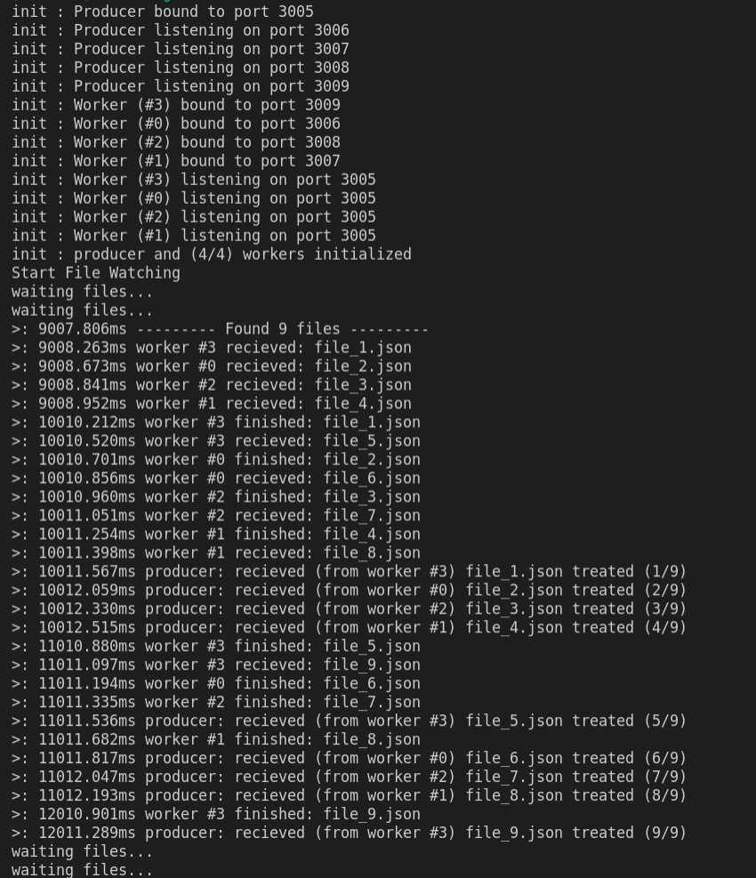

# TP Architecture logicielle (File watcher)

Maxime d'Harboullé - 4AL1 - ESGI - 2021
## Description
* Look at the console output while running*  

1. The producer and workers are initialized and connect to each other  

2. Will watch for files in assets/files_watcher, send them to the workers via a message queue (zeroMQ). Then the fileWatcher will recieve messages of workers when the fake treatments are completed and then remove the files from the watcher.  

3. Copy files in the watched directory ```./assets/test_files``` to ->```./assets/files_watcher```, and they should be processed by the workers (in logs, files are found, file is recieved by the worker and then producer recieves message that the worker finished processing the file and deletes the file)  

*Note: the workers finish a task and gets a new one from the queue before the producer gets back the message from the worker syaing its done*

## Installation

```npm install```

## Run

```npm start```
*App starts in index.ts*

## Example Screenshot
*Copying all test files from ```./assets/test_files``` to ->```./assets/files_watcher``` when app is running*

This test is set up with 4 workers


